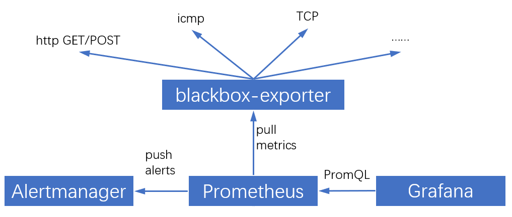
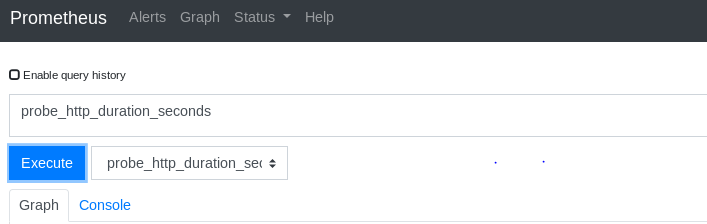
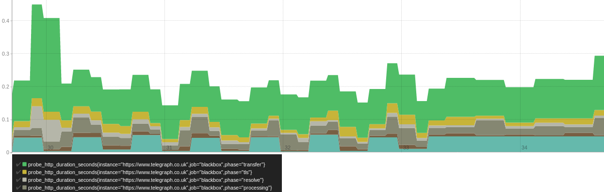
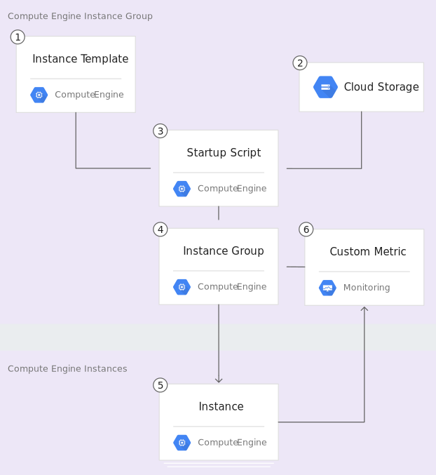

# Solution Test 3

## Monitor Response Time

### Tools

- `Prometheus` - is a monitoring application used for event monitoring and alerting. It records real-time metrics in a time series database (allowing for high dimensionality) built using a HTTP pull model, with flexible queries and real-time alerting.

- `blackbox_exporter` - Blackbox exporter allows blackbox probing of endpoints over HTTP, HTTPS, DNS, TCP and ICMP.

### Architecture



### Integrating Blackbox with Prometheus

- After install blackbox_exporter, add a blackbox job with below configurations inside the prometheus.yml file. We are going to monitor the performance of `https://www.telegraph.co.uk`

```yaml
- job_name: 'blackbox'
metrics_path: /probe
params:
module: [http_2xx] # Look for a HTTP 200 response.
static_configs:
- targets:
- https://www.telegraph.co.uk
relabel_configs:
- source_labels: [__address__]
target_label: __param_target
- source_labels: [__param_target]
target_label: instance
- target_label: __address__
replacement: 127.0.0.1:9115 # The blackbox exporter's real hostname:port.
```

- After configuration we will continue run the query at Prometheus with query `probe_http_duration_seconds`

- `probe_http_duration_seconds`: Response time of http request, summed over all redirects. This metric which is a httptrace based probe which allows us to gather fine-grained information throughout the lifecycle of an HTTP client request.



- A visualization will get created on the data being monitored by Prometheus



- We can see that the "processing" and "tls" portions of the HTTP probe have contributed the most to the increase in latency and may be worth looking at to reduce this latency for future spikes in traffic.

## Scalable and responsive most traffic

### Idea

- Set up a Compute Engine managed instance group that autoscales based on the value of a custom Cloud Monitoring metric
- Create a custom metric used to scale the instance group.
- Visualize the custom metric and instance group size.

### Description

- Prepare before scale Compute Engine instances. We will create roles Ansible for install application or service on GCE. After that, we write Python script for report a numeric value to a Monitoring metric. In response to the value of the metric, the application autoscales the Compute Engine instance group up or down as needed.

- The Python script is used as a way to seed a custom metric with values to which the instance group can respond. In a production environment, you would base autoscaling on a metric that is relevant to your use case.

Example custom metrics:

```bash
probe_http_duration_seconds{phase="connect"} 0
probe_http_duration_seconds{phase="processing"} 0
probe_http_duration_seconds{phase="resolve"} 0.061087943
probe_http_duration_seconds{phase="tls"} 0
probe_http_duration_seconds{phase="transfer"} 0
```

- The Python script varies the custom metric values it reports from each instance over time. As the value of the metric goes up, the instance group scales up by adding Compute Engine instances. If the value goes down, the instance group detects this and scales down by removing instances.

### Architecture



- The application includes the following components:

    + `Compute Engine instance template` — A template used to create each instance in the instance group.
    + `Compute Engine startup script` — A Ansible Playbook is installed and started automatically when an instance starts. When the startup script runs, it in turn installs and starts code on the instance that writes values to the Monitoring custom metric.
    + `Cloud Storage` — A bucket used to host the startup script and other script files.
    + `Compute Engine instance group` — An instance group that autoscales based on the Cloud Monitoring metric values.
    + `Compute Engine instances` — A variable number of Compute Engine instances.
    + `Custom Cloud Storage metric` —A custom monitoring metric used as the input value for Compute Engine instance group autoscaling.
